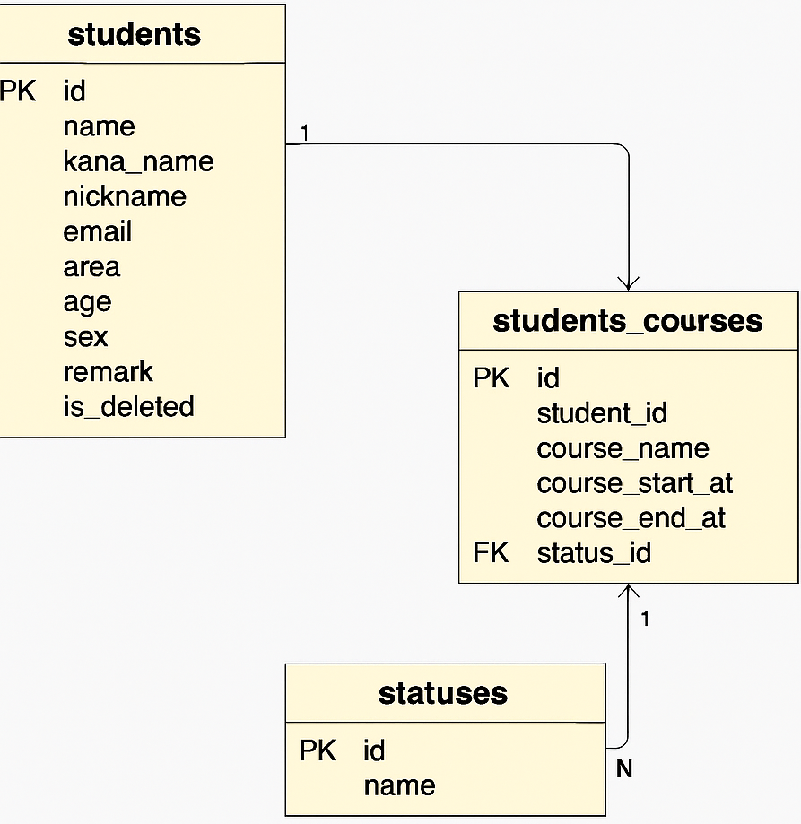
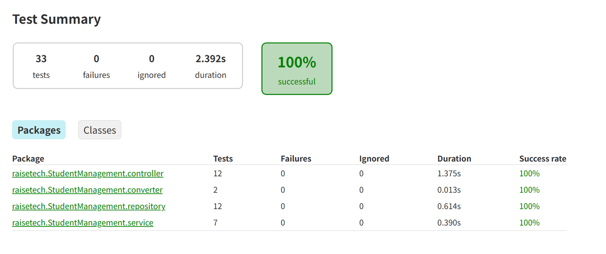
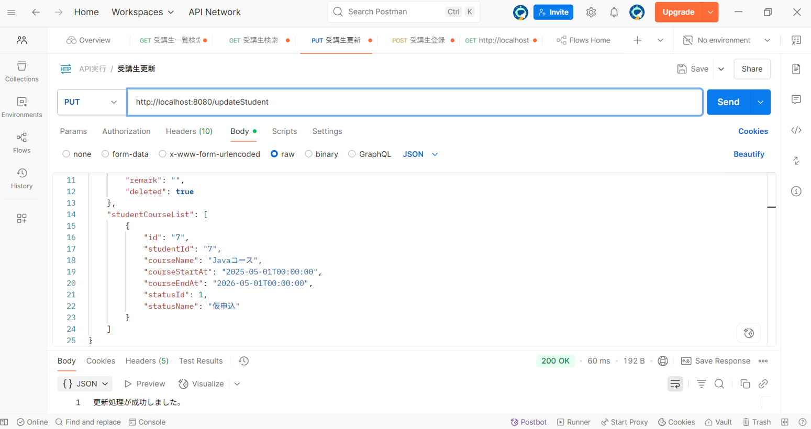
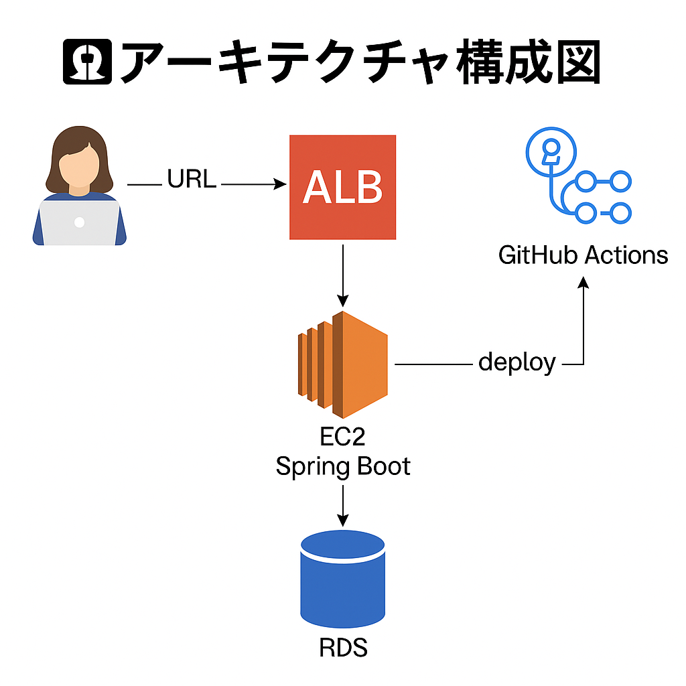

# 🎓 StudentManagement - 教育現場向け 受講生管理Webアプリ

教育現場での受講生情報の**登録・編集・削除や進捗管理をスムーズに行える**、Webアプリケーションです。  
Spring Boot / MySQL / AWS構成により、ブラウザ・API経由で動作します。

---

## 🔧 使用技術

- Java 21  
- Spring Boot 3.2  
- MySQL  
- Thymeleaf
- MyBatis（XMLベースのMapperを使用）
- Spring MVC（REST API開発）
- Lombok（DTOやEntityで活用）
- JUnit 5 / Mockito  
- Gradle  
- Git / GitHub

---

📁 ディレクトリ構成を見る（クリックで展開）

<pre>
src
├── main
│   ├── java
│   │   └── raisetech
│   │       └── StudentManagement
│   │           ├── config              // 起動設定用クラス（WAR対応など）
│   │           ├── controller          // APIエンドポイント
│   │           │   └── converter       // ドメイン⇔DTOの変換ロジック
│   │           ├── data                // DBエンティティ
│   │           ├── domain              // ビジネス用DTO（受講生詳細・検索条件など）
│   │           ├── exceptionHandler    // 共通エラーハンドラー
│   │           ├── repository          // MyBatisによるDBアクセス
│   │           ├── service             // ビジネスロジック
│   │           └── validaion           // バリデーショングループ（登録・更新用）
│   └── resources
│       ├── application.properties      // 本番・開発環境の設定
│       └── mapper
│           └── StudentRepository.xml   // MyBatisマッパー
├── test
│   ├── java
│   │   └── raisetech
│   │       └── StudentManagement
│   │           ├── controller          // Controller層の単体テスト
│   │           ├── converter           // Converter層の単体テスト
│   │           ├── repository          // MyBatisリポジトリテスト
│   │           └── service             // サービス層テスト（Mock注入）
│   └── resources
│       ├── application.properties      // H2用設定
│       ├── schema.sql                  // テスト用スキーマ定義
│       └── data.sql                    // テスト用初期データ

---

## 🗃️ ER図（受講生・コース・ステータス）

> ER図で全体像を把握しやすくした後、各テーブルの詳細は以下に記載しています。

---

## 🔍 テーブル定義一覧 

ER図の補足として、各テーブルのカラム定義や制約を以下にまとめています。

### 🧍‍♂️　students テーブル

| カラム名     | 型            | NULL許可 | キー種別 | デフォルト値 | 補足                            |
|--------------|----------------|-----------|----------|----------------|---------------------------------|
| id           | int            | NO        | PRI      | NULL           | 自動採番（主キー）             |
| name         | varchar(100)   | YES       |          | NULL           | 氏名                            |
| kana_name    | varchar(100)   | YES       |          | NULL           | フリガナ                        |
| nickname     | varchar(100)   | YES       |          | NULL           | ニックネーム                    |
| email        | varchar(100)   | NO        | UNI      | NULL           | 一意制約あり（重複不可）        |
| area         | varchar(100)   | YES       |          | NULL           | 地域                            |
| age          | int            | YES       |          | NULL           | 年齢                            |
| sex          | varchar(100)   | YES       |          | NULL           | 性別                            |
| remark       | varchar(255)   | YES       |          | NULL           | 備考                            |
| is_deleted   | tinyint(1)     | NO        |          | 0              | 論理削除：0=有効、1=削除済      |

📚 students_courses テーブル（クリックで展開）

| カラム名         | 型            | NULL許可 | キー種別 | デフォルト値 | 補足                                |
|------------------|----------------|-----------|----------|----------------|-------------------------------------|
| id               | int            | NO        | PRI      | NULL           | 自動採番（主キー）                 |
| student_id       | int            | NO        | MUL      | NULL           | 外部キー → `students.id`           |
| course_name      | varchar(100)   | NO        |          | NULL           | コース名                            |
| course_start_at  | datetime       | NO        |          | NULL           | 開始日                              |
| course_end_at    | datetime       | NO        |          | NULL           | 終了日                              |
| status_id        | int            | YES       | MUL      | 1              | 外部キー → `statuses.id`（初期値） |

📊 statuses テーブル（クリックで展開）

| カラム名 | 型           | NULL許可 | キー種別 | デフォルト値 | 補足                      |
|----------|---------------|-----------|----------|----------------|---------------------------|
| id       | int           | NO        | PRI      | NULL           | ステータスID（主キー）    |
| name     | varchar(50)   | NO        |          | NULL           | ステータス名（例：仮申込） |

---

## 📚 主な機能

| 機能カテゴリ         | 概要                                 |
|----------------------|--------------------------------------|
| 受講生管理機能       | 登録 / 一覧表示 / ID検索 / 条件検索 / 編集 / 論理削除 |
| ステータス管理       | 仮申込 / 本申込 / 受講中 / 受講終了 をコースごとに保持 |
| 検索機能             | 名前・性別・地域・削除済み など複数条件で検索可能 |
| テスト               | Service層のユニットテストを中心に実装（Mockito使用） |

---

## 🌐 画面URL一覧

| 画面名         | パス                         | 備考       |
|----------------|------------------------------|------------|
| 受講生一覧     | `/studentList`               | 初期画面    |
| 新規登録画面   | `/studentRegister`           | フォーム    |
| 編集画面       | `/studentEdit?id=1`          |             |
| エラー検証用   | `/testException`             | テスト用    |

💡 上記パスは、本番環境では `http://StudentManagementALB-xxxxx.ap-northeast-1.elb.amazonaws.com/` に続けてアクセスします。  
（※現在はEC2停止中）

---

## 🧪 テスト・動作確認の実施状況

アプリの品質と動作確認のため、以下のテスト・確認を実施しています。

### ✅ 単体テスト（JUnit / Mockito）

- Service層、Repository層、Converter層などを対象に33件のテストを実装
- Gradleで `./gradlew test` 実行し、HTMLレポートで結果確認（全件成功）
- テスト対象：登録・更新・検索・論理削除・例外ハンドリング など

📊 HTMLレポートによるテスト結果を表示（クリックで展開）

### ✅ Postman / Swagger でAPI動作確認

- ✅ [Swagger UIでAPI仕様を確認する](https://swagger-url.vercel.app/?url=...)
- PostmanでJSONを使って PUT /updateStudent を送信し、DBに反映されることを確認
- その他のエラーハンドリングも検証済

### 📝 更新処理（PUT /updateStudent）の実行例

下記は、Postmanを使って受講生情報を更新した際のリクエスト例です。  
論理削除フラグ（"deleted": true）や、受講コース情報も同時に更新されていることがわかります。

- リクエスト形式：JSON  
- エンドポイント：PUT /updateStudent  
- レスポンス：200 OK（更新成功）

🖼️ PostmanでのAPI更新リクエストの実行画面（クリックで展開）

---

## ☁️ AWS構成とデプロイへのこだわり

本アプリケーションは、AWSを使って本番運用を想定した構成でデプロイしています。

- 🔗 本番URL（ALB経由でEC2へルーティング）

http://StudentManagementALB-xxxxxxxx.ap-northeast-1.elb.amazonaws.com/studentList

### 🗂️ システム構成図（ユーザー視点）

---

## 🚀 ローカルでの起動方法

1. プロジェクトを IntelliJ などで開く  
2. `src/main/resources/application.properties` を作成し、以下の内容を記述
<pre> 　properties 
    spring.datasource.url=jdbc:mysql://localhost:3306/student_db 
    spring.datasource.username=root spring.datasource.password=（セキュリティのため非公開） 
    spring.jpa.hibernate.ddl-auto=update spring.jpa.show-sql=true server.port=8080 
    </pre>
📌 パスワードなどの機密情報は .gitignore に含めるよう注意し、GitHub等に公開しないようにしています。

---

## ✅ 使用AWSサービス

| サービス名 | 用途 |
|------------|------|
| EC2 | アプリのデプロイ先（Amazon Linux） |
| ALB | 外部からのトラフィックをEC2へ |
| RDS（MySQL） | アプリの本番用DBとして使用 |
| GitHub Actions | CI/CDでビルドとEC2への自動デプロイ |

---

## 🔁 GitHub Actions（CI/CD）

- `./gradlew bootJar` でビルド
- SCPでEC2へJar転送（秘密鍵はGitHub Secretsで管理）
- EC2内で `systemctl restart StudentManagement.service` を実行

### 使用した GitHub Actions（YAML）の例

<pre>
name: SSH Application Deploy
uses: appleboy/ssh-action@master
with:
  host: ${{ env.EC2_HOST }}
  username: ${{ env.EC2_USER }}
  key: ${{ secrets.AWS_EC2_PRIVATE_KEY }}
  script: |
    sudo systemctl restart StudentManagement
</pre>

---

## 💡 開発・運用で工夫したこと＆乗り越えた課題

### 🔧 開発・設計面での工夫

- **MyBatisの動的SQL**を活用し、検索条件に応じた柔軟なWHERE句を構築
- **DTO設計**により、`StudentDetail` や `StudentSearchCondition` など、ドメインロジックを明確に分離
- **パッケージ構成を役割ごとに整理**し、保守性と可読性を意識
- **ステータス管理機能**を実装し、受講生の進捗を一目で把握できるよう設計
- **Mockitoを活用したユニットテスト**で、依存注入＆モックによる疎結合な設計を実現

### ☁️ インフラ・運用面での工夫と苦労

- Elastic IPを使えない環境でも対応できるよう、GitHub Actions のYAMLを毎回手動で更新する工夫を実施
- `.jar`ファイルを `scp` でEC2に転送し、`systemd` による自動再起動構成を実現
- RDSのDB名の大文字・小文字の差異によりAPIが動かず、ローカルと本番のDBを統一し再構築
- 接続情報は `.gitignore` と GitHub Secrets を活用し、機密情報を厳重に管理

---

## 🙋‍♀️ 制作背景

病棟クラークとして3年勤務した経験から、業務における**「個人情報を正確・効率的に扱う」重要性**を痛感。  
その経験を活かし、教育現場の受講生管理業務を想定したアプリケーションとして本プロジェクトを開発しています。  
また、教育現場での受講生管理の煩雑さを減らし、「誰が・どのコースを・どのステータスで受講しているか」を把握しやすいように工夫しました。

---

## 🧠 こんな人に届けたい

- Java + Spring Boot で**実務に近いWebアプリを作ってみたい**学習者さん
 
- **GitHub Actions × EC2 × RDS でCI/CD環境を体験してみたい**人

- 実務に近い構成（プロパティ管理・systemd再起動など）を**手を動かして学びたい**人

---

## 🔗 リンク

- 本リポジトリ：[https://github.com/hanatani-dev/student-management-portfolio](https://github.com/hanatani-dev/student-management-portfolio)

---

## 🗒️ まとめ
このプロジェクトでは、Javaのバックエンド開発だけでなく、本番運用を想定したAWS構築や自動デプロイも実践しました。
ただコードを書くのではなく、「どうやって人に届けるか・継続運用するか」に向き合った経験を込めています🌱

